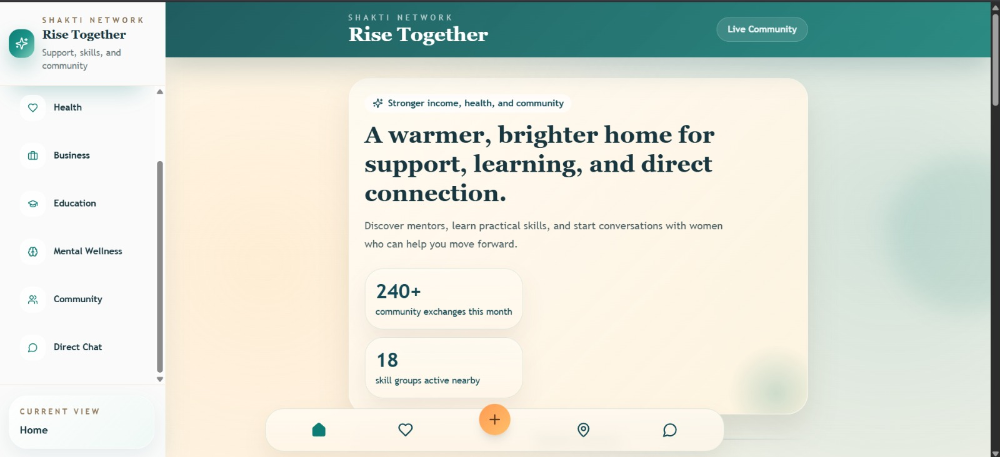
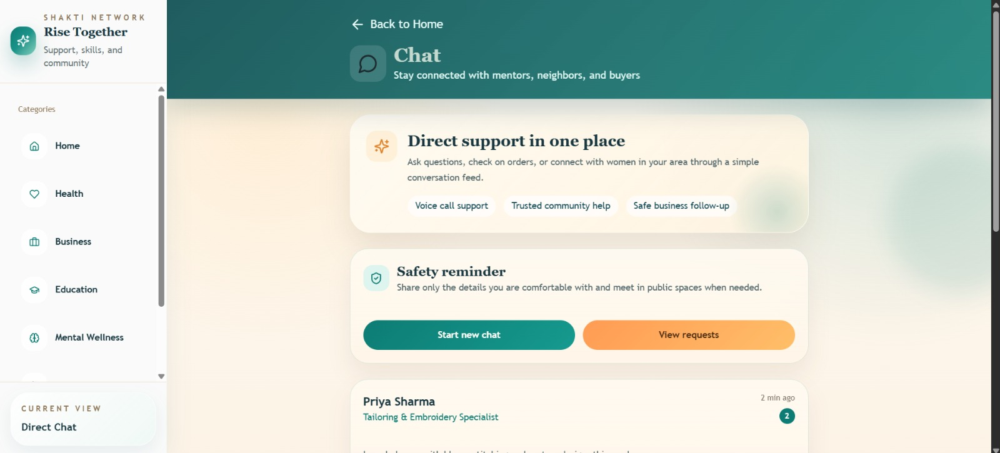
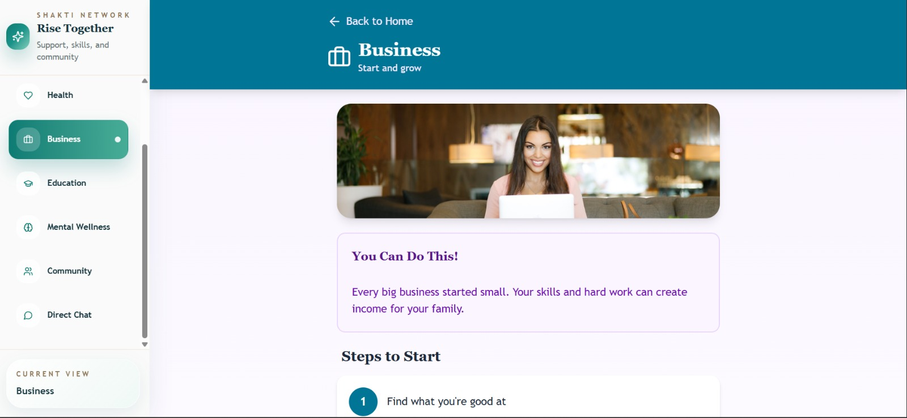
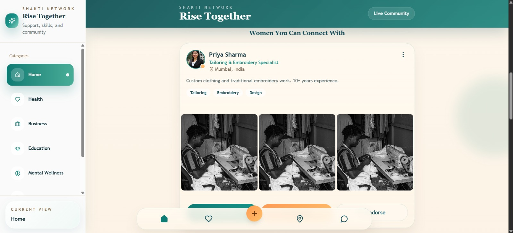

# 🌟 Shakti Network

> **Stronger income, health, and community** — A warmer, brighter home for support, learning, and direct connection.

---

## 📖 About the App

**Shakti Network** is a community platform built for women in rural and semi-urban India, bridging the gap between village communities and metro-city expertise. The app connects women with verified mentors and specialists across fields like business, health, education, and mental wellness — empowering them to build skills, grow income, and support one another.

Whether a woman wants to start a small tailoring business, learn about financial planning, access health guidance, or simply talk to someone who understands her journey — Shakti Network brings the right people and resources directly to her.

---

## ✨ Key Features

### 🏠 Home Feed
Discover mentors, browse skill groups, and explore live community exchanges — all from a single, welcoming home screen.



- **240+ community exchanges** happening every month
- **18 skill groups** active nearby
- Connect with verified women experts in your area

### 💼 Business & Skills
Step-by-step guidance to help women start and grow their own income sources.



- Practical "Steps to Start" guides for first-time entrepreneurs
- Motivational content tailored for beginners
- Expert-led skill sessions in tailoring, embroidery, design, and more

### 💬 Direct Chat & Mentorship
Safe, simple, and direct communication with mentors and community members.



- **Start new chats** with verified experts
- **Voice call support** for low-literacy accessibility
- **Trusted community help** and **safe business follow-up**
- Built-in safety reminders to protect user privacy

### 📂 Categories Covered
| Category | Description |
|---|---|
| 🏥 Health | Wellness tips, maternal care, and health guidance |
| 💼 Business | Start, grow, and sustain small businesses |
| 🎓 Education | Skill-building and learning resources |
| 🧠 Mental Wellness | Emotional support and community connection |
| 👩‍👩‍👧 Community | Connect with women near you |
| 💬 Direct Chat | Real-time messaging with mentors |

---

## 🔁 Session Flow

1. **Browse** verified experts by category or location
2. **Connect** via direct chat or voice call
3. **Attend** a skill session or mentorship exchange
4. **Re-book** the expert for follow-up sessions
5. **Rate & Review** the session to help the community

---

## 🚀 Getting Started

### Prerequisites
- Node.js (v18 or above)
- npm or yarn

### Installation & Running Locally

```bash
# Clone the repository
git clone https://github.com/HackIndiaXYZ/hackindia-spark-7-north-region-sakhiyaan.git REPO

# Navigate into the project directory
cd REPO

# Install dependencies
npm install

# Start the development server
npm run dev
```

The app will be available at `http://localhost:5173` (or as shown in your terminal).

---

## 🛠️ Tech Stack

- **Framework:** React (Vite)
- **Styling:** Tailwind CSS / CSS Modules
- **Routing:** React Router
- **State Management:** React Context / useState
- **Icons:** Lucide React or similar

---

## 📁 Project Structure

```
shakti-app/
├── public/
├── src/
│   ├── components/       # Reusable UI components
│   ├── pages/            # Home, Business, Chat, Health, etc.
│   ├── assets/           # Images and icons
│   ├── App.jsx
│   └── main.jsx
├── package.json
└── README.md
```

---

## 🖼️ Screenshots

| Screen | Preview |
|---|---|
| Home |  |
| Business |  |
| Community |  |
| Direct Chat |  |

---

## 🤝 Contributing

Contributions are welcome! Please open an issue or submit a pull request for any improvements.

---

## 📄 License

This project is licensed under the MIT License.

---

> *"Every big business started small. Your skills and hard work can create income for your family."* — Rise Together